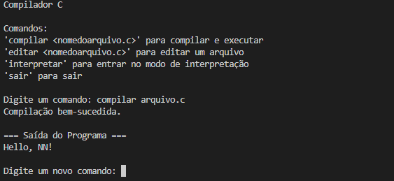
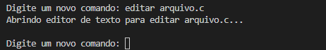
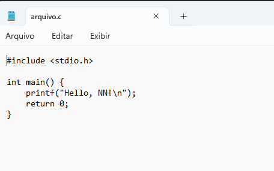
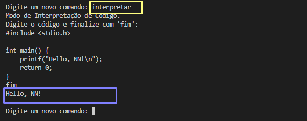

# Compilador C Simples

Este é um compilador simples em C que permite compilar, executar e interpretar código C diretamente do terminal.

## Funcionalidades

- **Compilar e Executar:** Compila e executa um arquivo `.c`.
- **Editar:** Abre um arquivo `.c` para edição no editor de texto padrão do sistema.
- **Interpretar:** Permite digitar código C diretamente no terminal para compilar e executar temporariamente.
- **Sair:** Encerra o compilador.

## Funcionalidades Suportadas

- **Verificação de Blocos**: Verifica a presença e o fechamento correto de blocos `{ } [ ] ( )  " "    ' '`.
- **Sintaxe dos Comandos**: Suporta comandos como `include`, `main`, `printf`, `scanf`, `if else`, `for`, `while`, `switch case`.
- **Execução de Expressões**: Compila e executa expressões válidas em arquivos C.

## Como Usar

1. **Compilação do Programa**
   - Abra um terminal.
   - Navegue até o diretório onde está o arquivo `compilador.c`.
   - Compile o programa usando o GCC:
     ```
     gcc -o compilador compilador.c
     ```

2. **Execução do Simulador de Terminal**
   - Após compilar, execute o simulador de terminal:
     ```
     ./compilador
     ```

3. **Instruções de Uso**

**Compilar e Executar um Arquivo:**
   - Digite o comando `compilar arquivo.c` para compilar e executar o arquivo `arquivo.c`.
   - O compilador exibirá se a compilação foi bem-sucedida e, se for o caso, executará o programa compilado.
   
   Observação: Pode compilar qualquer arquivo .c que está dentro da mesma pasta, desde que utilize o comando `compilar nomedoarquivo.c`

**Editar um Arquivo:**
use o comando `editar <nomedoarquivo.c>`

Abre o arquivo `.c` especificado no editor de texto padrão do sistema para edição.

**Interpretar Código:**
Entra no modo de interpretação de código. Permite digitar diretamente o código C no terminal. Finalize com a palavra-chave `fim`.

**Sair do Compilador:**
`sair`
Encerra o compilador.

4. **Tratamento de Erros**
   - Se ocorrer um erro durante a compilação, o compilador mostrará a mensagem de erro correspondente.

## Exemplo
### 🐧 Compilar codigo



### ✏️ Editar código


Blocos de notas e aberto para edição do código, e só alterar e clicar em salvar 



### ⚙️ Interpretar 
Permite editar o código, compilar e se houver erro e retornado ao terminal. 
